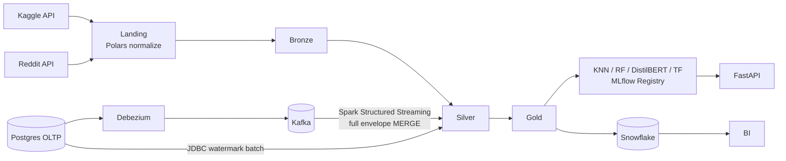

# lakehouse-ml-platform

Production-grade **Medallion lakehouse** with **real-time & batch CDC**, **Airflow orchestration**, and an **ML/AI layer** spanning classical models (KNN, Random Forest) and deep learning (DistilBERT on PyTorch/CUDA, TensorFlow BiLSTM) — deployed to **dev/qa/prod** through GitHub Actions and Jenkins.

[](.github/workflows/ci.yml)
[](pyproject.toml)
[](LICENSE)

## Architecture



Full details: [docs/architecture.md](docs/architecture.md) · [docs/cdc.md](docs/cdc.md) · [docs/deployment.md](docs/deployment.md) · [docs/scaling_pinot_iceberg_flink.md](docs/scaling_pinot_iceberg_flink.md)

## What's inside

| Capability | Implementation |
|---|---|
| Ingestion | Kaggle Datasets REST API + Reddit public JSON API → Polars-normalized landing zone with batch manifests |
| Medallion | Delta Lake Bronze (append-only, `replaceWhere` idempotency) → Silver (dedup + `MERGE` + DQ gates) → Gold (aggregates + ML feature table) |
| Data quality | Declarative expectations engine with `warn / drop / fail` semantics and a Delta audit trail |
| CDC (real-time) | Postgres → Debezium (full envelope, deletes included) → Kafka → Structured Streaming `foreachBatch` MERGE |
| CDC (batch) | High-watermark JDBC extraction with a Delta watermark control table |
| Orchestration | Airflow DAGs (daily medallion, hourly CDC sync, weekly ML retraining) driving one shared CLI |
| ML — classical | TF-IDF + KNN and Random Forest with `GridSearchCV`, MLflow tracking, champion registration |
| ML — deep | DistilBERT fine-tuning (CUDA AMP, TF32, warmup schedule, early stopping) and TensorFlow BiLSTM (mixed_float16) |
| MLOps | MLflow as a first-class component: Tracking Server in the local stack (Postgres backend), env-driven URIs (local server in dev, Databricks-managed in qa/prod), experiment tracking with standard tags (env, git SHA, dataset), Model Registry with champion/challenger promotion |
| Serving | FastAPI + MLflow `@champion` alias, multi-stage Docker image |
| Delivery | Gold → Snowflake via transactional staged `MERGE` |
| IaC | Terraform: versioned/encrypted S3 per layer, least-privilege IAM, optional MSK — per-env tfvars |
| CI/CD | GitHub Actions (CI matrix + reusable deploy with OIDC → dev/qa/prod) and an equivalent Jenkinsfile |
| Scale-out seam | Flink SQL (Debezium → Iceberg upsert) and Pinot realtime table configs, adoption criteria documented |

## Quickstart (local)

```bash
git clone <repo> && cd lakehouse-ml-platform
cp .env.example .env            # fill KAGGLE_USERNAME / KAGGLE_KEY at minimum
./scripts/bootstrap_local.sh    # venv + deps + docker CDC stack + Debezium connector

make pipeline                   # ingest -> bronze -> silver -> gold
make train-classical            # KNN + RandomForest (tracked in MLflow at :5000)
make train-bert                 # DistilBERT (uses CUDA automatically if present)
make serve                      # FastAPI on :8000
# MLflow UI: http://localhost:5000 (started by bootstrap / make up)

# CDC demo
python scripts/generate_oltp_traffic.py --iterations 100
python -m lakehouse.cli cdc-stream --once     # streaming backfill
python -m lakehouse.cli cdc-batch             # watermark sync
```

## Repository layout

```
conf/                  Layered env config (base + dev/qa/prod overlays)
src/lakehouse/
  common/              config, logging, secrets resolver, Spark factory
  ingestion/           Kaggle & Reddit clients, Polars landing normalizers
  medallion/           bronze.py / silver.py / gold.py
  quality/             declarative expectations engine (warn/drop/fail)
  cdc/                 merge primitives, streaming (Debezium envelope), batch watermark
  delivery/            Snowflake staged-MERGE loader
  ml/                  features, classical & deep trainers, registry, FastAPI serving
airflow/dags/          medallion_daily, cdc_batch_sync, ml_weekly_training
cdc/                   docker Postgres init + idempotent Debezium registration
databricks.yml         Asset Bundle: dev/qa/prod job targets (incl. GPU task)
infra/terraform/       S3 layers, IAM, optional MSK; envs/{dev,qa,prod}.tfvars
snowflake/ddl/         idempotent role/warehouse/table bootstrap
flink/ · pinot/        scale-out artifacts (see scaling doc)
.github/workflows/     ci + reusable deploy + cd-dev/qa/prod
ci/jenkins/            declarative Jenkinsfile with prod approval gate
tests/                 pytest suite (local Delta Spark fixtures)
```

## Datasets

- **Kaggle — Amazon Fine Food Reviews** (`snap/amazon-fine-food-reviews`): ~568k text reviews with 1–5 scores; drives the sentiment feature table and all model training.
- **Reddit public JSON API**: engagement analytics over configurable subreddits (no OAuth app needed for public listings).
- **Synthetic Postgres OLTP** (`customers`, `orders`): realistic insert/update/delete workload for both CDC paths via `scripts/generate_oltp_traffic.py`.

Swap datasets by editing `conf/base.yaml -> sources.*`; the landing normalizers are the only code that knows vendor formats.

## Environments & promotion

`main` → **dev** (auto) · `v*-rc*` tags → **qa** · `vX.Y.Z` tags → **prod** (manual approval). Same wheel, same bundle, different targets — see [docs/deployment.md](docs/deployment.md).

## License

MIT — see [LICENSE](LICENSE).
