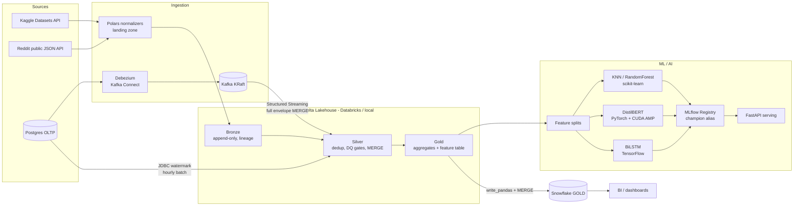

# Architecture

## Overview

The platform is a Medallion lakehouse (Bronze → Silver → Gold on Delta Lake) fed by two ingestion families — batch API pulls (Kaggle, Reddit) and CDC (Debezium over Postgres, in both streaming and batch flavors) — with an ML/AI layer that trains classical and deep models over the Gold feature table, and a Snowflake delivery path for BI.

## Layer contracts

| Layer | Guarantees | Write pattern |
|---|---|---|
| Landing | Raw vendor formats + normalized typed Parquet with `_MANIFEST.json` per batch | Immutable files |
| Bronze | Raw-but-typed, append-only, lineage columns (`_batch_id`, `_ingest_ts`, `_source`), replayable | `replaceWhere` on `_batch_id` (idempotent) |
| Silver | Deduplicated on natural keys, cleansed text, DQ gates (warn/drop/fail), CDC targets | Delta `MERGE` |
| Gold | Business aggregates, serving-ready joins, ML feature table | Overwrite (rebuildable from Silver) |

## Orchestration

Airflow owns the *schedules*; the package CLI owns the *logic*. Every DAG task shells into `python -m lakehouse.cli <stage>`, which means the identical code path runs locally, in Airflow, and as Databricks wheel tasks — no logic drift between environments.

## Configuration & environments

`conf/base.yaml` + `conf/{dev,qa,prod}.yaml` overlays with `${VAR:default}` interpolation. `LAKEHOUSE_ENV` selects the overlay; `LAKEHOUSE_ROOT` moves the entire lakehouse between local disk and S3 without code changes. Secrets resolve env → Databricks secret scope → AWS Secrets Manager.

## Why Polars *and* Spark

Landing normalization is single-node file wrangling where Polars' lazy streaming engine is faster and cheaper than spinning Spark; everything from Bronze onward is Spark/Delta because it needs MERGE, time travel, schema evolution and cluster scale. pandas appears only at well-defined edges (Snowflake `write_pandas`, sklearn interop).
